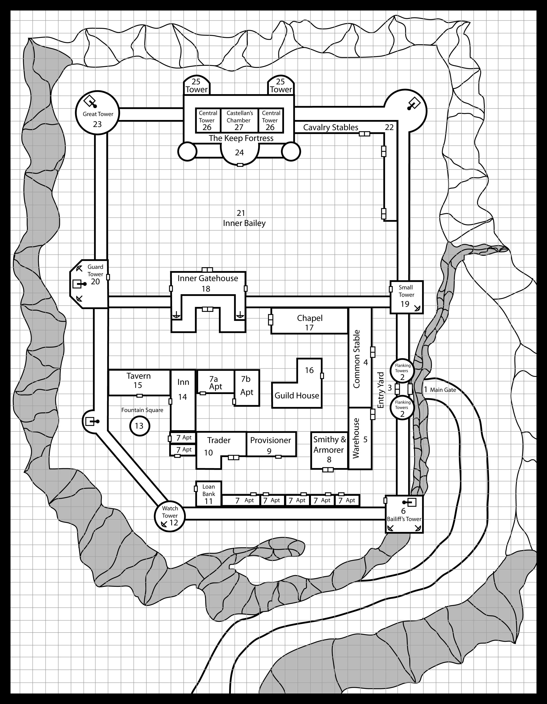

\pagebreak

## The Keep

#### Background

The Realm of mankind is narrow and constricted. Always the forces of Chaos press upon its borders, seeking to enslave its populace, rape its riches, and steal its treasures. If it were not for a stout few, many in the Realm would indeed fall prey to the evil which surrounds them. Yet, there are always certain exceptional and brave members of humanity, as well as similar individuals among its allies - dwarves, elves, and halflings - who rise above the common level and join battle to stave off the darkness which would other- wise overwhelm the land. Bold adventurers from the Realm set off for the Borderlands to seek their fortune. It is these adventurers who, provided they survive the challenge, carry the battle to the
enemy.

#### RR Notes About the Keep

Entrance to the Inner Bailey can be gained if the adventurers perform a heroic act in behalf of the Keep, if they bring back an exceptional trophy or valuable prisoners, or if they contribute a valuable magic item or 1,000 or more gold pieces to the place. They will be invited to a feast and revel, and then closely watched and carefully questioned. If the Castellan’ likes the looks of the group, and his assistants agree, he will ask them to perform a special mission (suitable to their ability, but difficult - use the area map or the Caves Chaos to find a suitable goal). On the other hand, if they are rude or behave badly, he will simply retire early, ending the revel, and they will never be aided or invited back. If they try to steal or are threatening, the group will be attacked and killed immediately (if this can be managed, of course).

#### RUMORS

See original module (page 7) for the Rumors table

#### Areas of the Keep

1. Main Gate:
    * Approaching the keep, there are corpses hanging from nooses with signs stating “This is what happens to thieves, murderers, and rapists.”
    * Two 30 foot towers with battlements.
    * Drawbridge (usually up) spans a deep crevice.
    * Portcullis at the entry.
    * 2 men-at-arms will approach all who seek entry. The tax for entry ranges from 1-10 gp based on assessed wealth.
2. Flanking Towers:
    * Atop each tower are crossbowmen.
    * Inside are 12 other men-at-arms.
3. Entry Yard:
    * Narrow and paved.
    * The corporal of the watch is here and is rather grouchy.
    * Beside him is the scribe who records the name of each person who enters or leaves.
4. Common Stable:
    * Visitors and inhabitants of the Keep keep their horses and mules here.
5. Common Warehouse:
    * Visiting merchants and other travelers who have goods are required to keep their materials here until they are sold or taken elsewhere.
    * The doors are locked and the corporal of the watch must be called to gain entry.
6. Bailiff’s Tower:
    * The bailiff (or superintendent) lives here.
    * The bailiff and the scribe share offices on the lower floor
    * Living quarters are on the second story.
    * The third floor is a storage area.
    * The forth floor quarters 12 men-at-arms.

\pagebreak

\pagebreak

#### Areas of the Keep (2)

7. Private Apartments:
    * Special quarters for well-to-do families, rich merchants, guild masters, and the like.
    * There are 5 apartments. The 2 largest currently house a jewel merchant and a priest.
    * a. Jewel Merchant:
        * The man and his wife are guarded by 2 fighters with dogs trained to kil
        * They are awaiting a caravan back to more civilized lands.
    * b. Priest:
        * The home of the portly and jovial Priest who is stopping over at the Keep to discuss theology.
        * Everyone speaks highly of him, although his 2 Acolytes are avoided (since they never speak due to the vows of silence).
        * They are actually chaotic and evil staying at the Keep to spy and hinder those that would challenge the Caves of Chaos.
8. Smithy and Armorer:
    * Large forge and bellows.
9. Provisioner:
    * Sells equipment often necessary for dungeon delving.
10. Trader:
    * Deals in armor, weapons, and large quantities of goods (salt, spices, cloth, lumber, etc).
    * The trader is very interested in obtaining furs.
11. Loan Bank:
    * Money and gems can be exchanged for a 10% fee.
    * Personal wealth can be stored here for free if it is at least 1 month, otherwise, there is a 10% fee.
12. Watch Tower:
    * 12 men-at-arms.
    * Captain of the Watch is here and his quarters are on the first floor
    * The second and third floors are barracks
13. Fountain Square:
    * Large, gushing fountain in the center of the square.
    * There are frequently farmers and tradesmen selling the goods and wares.
14. Travelers Inn:
    * 5 small private rooms and a large common sleeping room for 12.
15. Tavern:
    * A favorite place for visitors and inhabitants alike.
    * Excellent food and generous drinks.
    * The barkeep (if talking with a good customer and drinking to his health) will sometimes talk about the lands around the Keep.
    * There is a 50% chance that a mercenary man-at-arms will be looking for work.
16. Guild House:
    * When members of any guild travel to the area, they are offered the hospitality of this two-story building.
    * Any trader who passes through must pay guild dues of 5% of the value of their merchandise. In return, they gets the protection of the Guild House.
    * The Guild Master is very influential an his favor or dislike will be reflected in th treatment of persons by fortress personnel.

\pagebreak

\pagebreak

#### Areas of the Keep (3)

17. Chapel:
    * The spiritual center of the Keep.
    * The Curate runs the chapel and is the most influential person in the Keep except for the Castellan. The Curate will, for the right offering, provide healing services. If questioned closely by a friend, the Curate will reveal his distrust of the Priest (area 7b). The Acolytes,however, think highly of the Priest.
    * 3 Acolytes are present at most times.
18. Inner Gatehouse:
    * This stone structure is like a small fort.
    * The gates are heavy and double bound with iron and spikes.
    * 6 guards on duty at all times along with 1 offic
    * First floor is the main armory and th quarters for the Sergeant and Captain of the Guard.
    * 24 guardsmen are quartered here.
19. Small Tower:
    * 8 guardsmen.
20. Guard Tower:
    * Houses 24 guardsmen and a corporal.
21. Inner Bailey:
    * Entire area is grass-covered.
    * Troops dill here.
    * 6-12 soldiers are always present in weapons practice.
22. Cavalry Stables:
    * 30 war horses are stabled here.
23. Great Tower:
    * Houses 24 guardsmen and a corporal.
24. The Keep Fortress:
    * The fortress is solidly built and has many tiers. The door is solid iron.
    * Inside are a great hall, an armory, and several side chambers for dinners and meetings,
    * The cellar below is well provisioned.
    * The second floor are rooms for up to 3 cavalrymen, and 2 chambers for guests.
    * There are 20 cavalrymen currently housed here.
25. Tower:
    * 40 foot high with battlements.
26. Central Towers:
    * The towers rise about the roof of the fortress.
    * Upper stories have 12 men-at-arms.
    * The lower floors hold the Castilian’s assistants: a scribe and an advisor.
27. Castellan’s Chamber:
    * The private room of the keep’s commander.
    * Lavishly furnished.
    * The Castellan - Strikes: 5, To-Hit 4; crits on 5+; has 2 potions of healing on him.

\pagebreak
