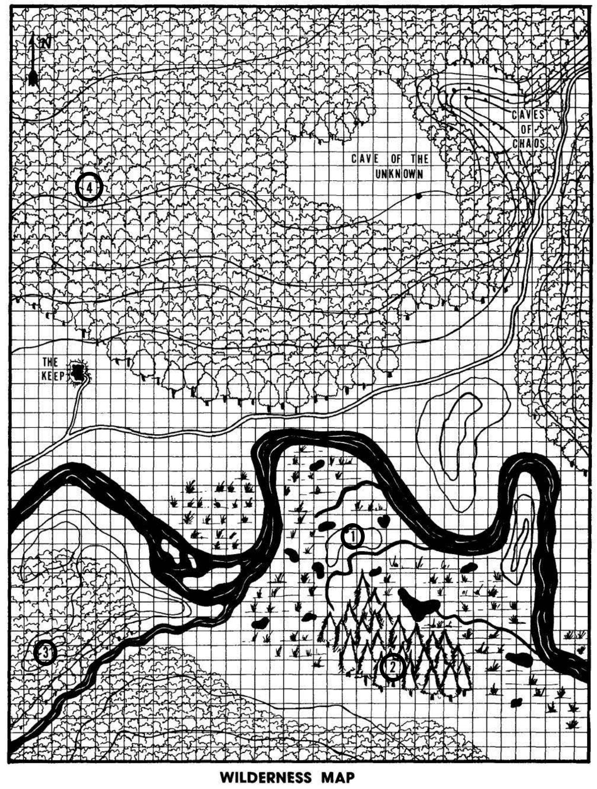

\pagebreak

\pagebreak

## Adventures Outside the Keep

* Just to the west (off the map) is the Village of Hirot.
* The Caves if the Unknown are hidden within the forest to the west of the Caves of Chaos.

#### Camping Outdoors Overnight
* Usually, nothing will bother the party when camping outdoors 
    * (unless within proximity of the Mound, the Grove, the Raider Camp[south of the Keep within the forest], or the Mad Hermit). 
    * When close to one of the areas, a roll of 4+ will indicate a random encounter appropriate for the area.

1. Mound of the Lizardmen
* The streams and pools of the fens are the home to a tribe of lizardmen. 
* The tribe is nocturnal and will not bother individuals moving about in daylight unless setting foot on the mound. 
* There are 6 lizardmen who will exit the mound and attack, and another 3 adults, and 8 young that will remain hidden.

2. The Grove/Spiders' Lair
* Two giant spiders have spun their webs amongst the trees.
    * AC 6 [13], HD 3* (13hp), Att 1 × bite (2d6 + poison), THAC0 17 [+2], MV 60’ (20’) / 120’ (40’) in webs, SV D12 W13 P14 B15 S16 (2), ML 8, AL Neutral, XP 50 
* Under a pile of leaves, there is a skeleton of a victim (a hapless elf). 
    * There is a Filthy looking shield on the body.  Looks worthless at first look.  It is a **+1 Shield**.  Must be repaired before it may be used.

\pagebreak

\pagebreak

## Adventures Outside the Keep (2)

* Just to the west (off the map) is the Village of Hirot.
* The Caves if the Unknown are hidden within the forest to the west of the Caves of Chaos.

#### Camping Outdoors Overnight
* Usually, nothing will bother the party when camping outdoors 
    * (unless within proximity of the Mound, the Grove, the Raider Camp[south of the Keep within the forest], or the Mad Hermit). 
    * When close to one of the areas, a roll of 4+ will indicate a random encounter appropriate for the area.

3. The Raider Camp
* There are 12 raiders camped here. The camp is close enough to spy on the Keep
* but far enough away to avoid patrols.
* Raider Leader - Strikes: 5, To-Hit: 4.
* Raider Lieutenant - Strikes: 4, To-Hit: 4.
* Remainder are men-at-arms.

4. The Mad Hermit
* For many years a solitary hermit has haunted this area of the forest, becoming progressively wilder and crazier and more dangerous. 
* His home is in a huge hollow oak, the entrance to the hollow concealedby a thick bush.
* Has a pet Mountain Lion who will join a fight depending on circumstance.
* Treasure buried beneath a few inches of dirt under the Bed
    * 31 Gold Pieces.
    * 164 Silver Pieces.
    * Potion of **Invisibility**.
    * **Dagger +1**
* Mad Hermit - 3rd level thief, AC 4 [15] due to leather armor, **ring of protection +1**, and Dexterity 17, hp 15, Att 1 (1d6+2) THAC0 17 [+2], ML 10.
    * The hermit has a 30% chance to **move silently** and a 20% chance to **hide in shadows**. 
    * His madness gives him a +2 bonus to hit and a +2 bonus on damage. 
    * His bonus for striking from behind is +6 to hit, and double normal damage +2 points. 
    * He carries no treasure other than the ring he wears.
* Mountain Lion
    * AC 6 [13], HD 3+2 (15hp), Att 2 × claw (1d3), 1 × bite (1d6), THAC0 16 [+3], MV 150’ (50’), SV D12 W13 P14 B15 S16 (2), ML 8, AL Neutral, XP 50
\pagebreak
